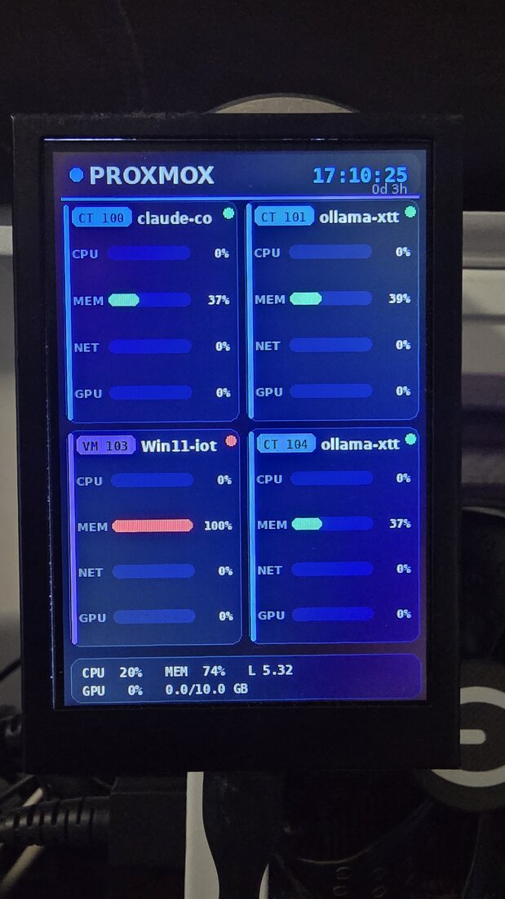

# proxmox-lcd-panel

A live **Proxmox dashboard on a 3.5" USB LCD** (Turing Smart Screen, Rev A, 320×480).
It renders every *running* VM and LXC container with real-time per-machine metrics, straight
onto the little screen sitting next to your server — no browser, no touch, just glanceable status.

<p align="center"></p>

It is a single drop-in script for the excellent
[**turing-smart-screen-python**](https://github.com/mathoudebine/turing-smart-screen-python)
project: it reuses that project's display driver (`library/`) and replaces the built-in themes with
a custom, fully PIL-rendered Proxmox panel.

## What it shows

A 2×4 grid of cards (auto-paginated when you have more than 8 machines), one per running guest:

- **CPU %** — from `pvesh .../status/current` (normalized across cores).
- **MEM %** — real in-guest usage: for VMs it uses `ballooninfo` (`total_mem − free_mem`) when the
  guest agent reports it, avoiding the false 100% you get from the balloon target.
- **NET %** — throughput from the delta of `netin + netout` between refreshes, scaled to a 1 Gbps bridge.
- **GPU (SM) %** — per-machine NVIDIA GPU load, obtained by parsing `nvidia-smi pmon` and mapping
  each process back to its VM/CT through the cgroup (`/lxc/<id>` or `/<vmid>.scope`). Shows 0 when the
  GPU is passed through (VFIO) or the guest doesn't touch it.

Containers (CT) and virtual machines (VM) are colour-coded, and a header/footer show host summary and
page indicators. Refresh every ~2 s.

## Interaction

The panel is read-only, but you can **flick the host's mouse wheel** to change pages manually
(via `evdev`, with hot-plug support); auto-pagination pauses for a few seconds after you do.

## Hardware

- A **Turing Smart Screen 3.5"** (a.k.a. XuanFang / generic "USB system monitor" LCD), Rev A, 320×480,
  connected over USB (appears as `/dev/ttyACM0`).
- A Proxmox VE host (the script calls `pvesh` locally). NVIDIA GPU optional (for the GPU metric).

## Install

```bash
# 1) Get the base project (provides the USB display driver)
git clone https://github.com/mathoudebine/turing-smart-screen-python.git
cd turing-smart-screen-python
python3 -m venv venv && ./venv/bin/pip install -r requirements.txt Pillow evdev

# 2) Drop this script in and run it
cp /path/to/proxmox_panel.py .
sudo ./venv/bin/python proxmox_panel.py
```

Run it as a service with the provided `lcd-panel-proxmox.service.example` (edit the paths).

## Configuration (environment variables)

| Var | Default | Meaning |
|---|---|---|
| `LCD_PORT` | `/dev/ttyACM0` | serial port of the LCD |
| `LCD_BRIGHTNESS` | `80` | 0–100 |
| `LCD_PERIOD_S` | `2.0` | refresh period (seconds) |
| `PVE_NODE` | `pve` | Proxmox node name |

## Credits & license

Built on top of [turing-smart-screen-python](https://github.com/mathoudebine/turing-smart-screen-python)
by Matthieu Houdebine and contributors (GPL-3.0). This script only depends on that project's `library/`
and is provided under the same spirit — see that repo for the display-driver license.

---
By [@chemazener](https://github.com/chemazener).
